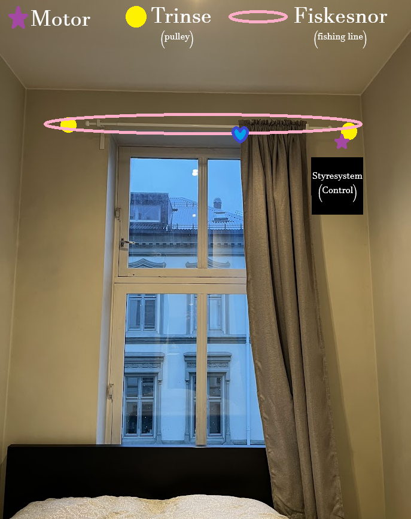

# Curtain Cobain

Welcome to my curtain-opener project! This system has the functionality to open and close a curtain manually by clapping twice, and later on I will add functionality to open them by clicking a button on a website.

# But how?

The system consists of an ESP32 MCU that controls a stepper motor and corresponding driver, that again turns a fishing line either to the right or to the left. The fishing line is sewn into the end of the curtain, symbolized with the blue heart in the below picture. Two pulleys are made using a 3D-printer, on which the fishing line rotates around.

## Control

The control system is to ble placed inside a 3D-printed casing and placed on a shelf screwed to the wall.
A microphone is to be coupled to the MCU, where after having its input signal amplified, will trigger the MCU to toggle the motor after detecting two consecutive claps. The toggling should also be controlled through a back-end system to a website - either by MQTT or by continuously checking a database.
